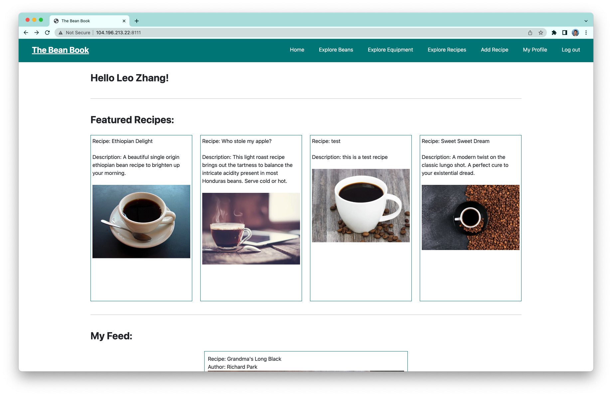
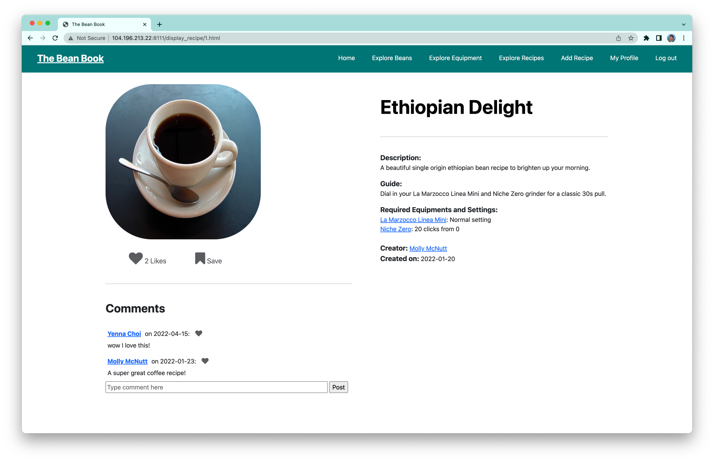

<h1 align="center">The Bean Book</h1>

## Project Description

<strong>The Bean Book is a multi-page web application that allows users to create, share, and explore specialty coffee recipes.</strong> (This is the final project for <em>W4111 Intro to Databse</em> @ Columbia SEAS.)     This project focuses on designing a relational database schema for a social media platform with features such as <strong>creating posts, sharing, saving, liking, following, and commenting</strong>.

## Built With

- <strong> PostgresSQL </strong>
- <strong> Python </strong>
- <strong> Flask </strong> 
- <strong> HTML </strong>
- <strong> CSS </strong>
- <strong> AWS RDS </strong>
- <strong> Google Could Platform </strong>

## Screenshots

## Author
- [Leo Zhang](https://github.com/leozhvng23 "Leo Zhang")
